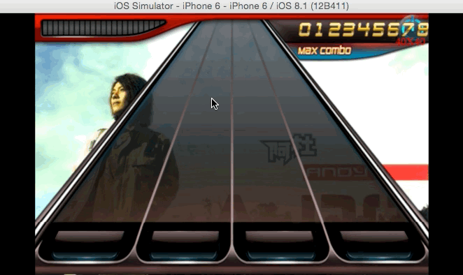

# Rhythm

Cocos2d-x v2.2 Rhythm Game

---

#Cocos2d-x 开发《节奏大师》游戏

用Cocos2d-x开发跨平台游戏，高仿《节奏大师》游戏

## 环境

* Cocos2d-x v2.2
* Mac + xcode (下载项目，拷贝到Cocos2d-x v2.2下的projects目录，proj.ios可以直接打开编译运行)
* 其他平台自己编辑资源和源码引用

## 游戏截图

